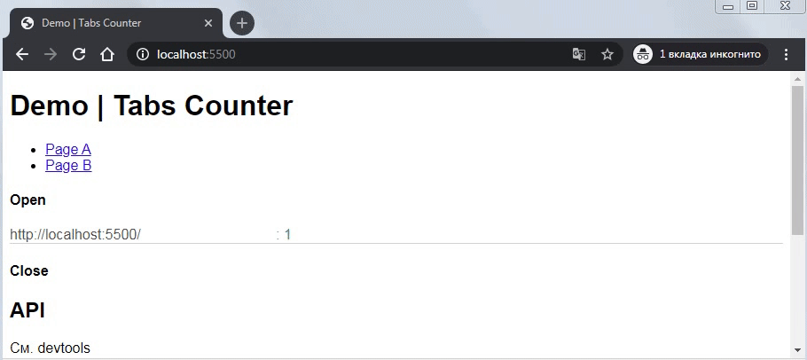

# Tabs Counter

    npm i tabs-counter

Отслеживает открытые вкладки браузера текущего сайта.



Метод основан на создании временного `URL.createObjectURL() => blob:http//...`(пока живет document), обмене через `localStorage` и проверки его существования через `fetch(URL)`.

* [Использование](#использование)
* [API](#api)

## Использование

Страницы, которые необходимо включить в рузультат подсчета, должны импортировать "tabs-counter" и вызвать `Counter(...)`:

```js
import Counter from 'tabs-counter'

// Считаем кол-во одинаковых адресов url
const calculate = (data) => {
  let urls = new Map()
  for (let url of Object.values(data)) {
    let count = urls.get(url)
    urls.set(url, (count ? ++count : 1))
  }
  const entries = [...urls.entries()]
  for (let [url, count] of entries) {
    console.log(`"${url}": ${count}`)
    // => "http://site/foo": 2
    // => "http://site/bar": 1
  }
}

// Слушатель
const listener = ({ open, close }) => {
  calculate(open)
  calculate(close)
}

// Вызываем как функцию
const counter = Counter({ key:'tabs-counter', listener })
// ...
```

Если страница не предполагает использования API, но должна учитываться в результатах, код может быть импортирован без установки слушателя:

```js
import Counter from 'tabs-counter'
Counter({ key:'tabs-counter'})
```

## API

### Counter(options?)

Возвращает объект с нижеуказанными методами.

```js
// options Необязательные опции
{
  // По умолчанию, ключом localStorage является "tabs-counter"
  key: 'tabs-counter',
  // Устанавливает слушателя изменения localStorage, после вызова Counter(...)
  onChanges: true,
  // Слушатель вызывается при каждом открытии/закрытии вкладки сайта
  // ... можно установить в любой момент
  listener: Function
}
```

В `listener({open,close})` передается объект, где каждое свойство содержит результат подобный вызову `get()`.

```js
{
  open:  { "blob...": "http...", ... }, // открытые вкладки
  close: { "blob...": "http...", ... }, // закрытые
}
```

Закрытые вкладки(`close:{...}`) не сохраняются, при повторном вызове объект не будет содержать предыдущий результат.

### on()

Возобновляет отслеживание изменений localStorage, если был вызван `off()`.

### off()

Временно приостанавливает отслеживание изменений localStorage.

### get()

Возвращает объект, где ключом является уникальный url, а значением реальный адрес `document.URL`. Результат содержит открытые вкладки или пустой объект, если был вызван `off()`.

```js
{
  "blob:http://site/a1e99ad5-fe7c...": "http://site/"
  "blob:http://site/bf4ac9d1-35c8...": "http://site/foo.html"
  "blob:http://site/fa68258f-bc9c...": "http://site/foo.html"
}
```

### test()

Принудительно тестирует доступность уникальных url(`blob:http://...`) и вызывает `listener({open,close})`.

### addListener(listener)

Добавить слушателя.

### removeListener(listener)

Удалить слушателя.
